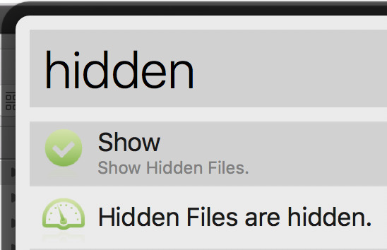
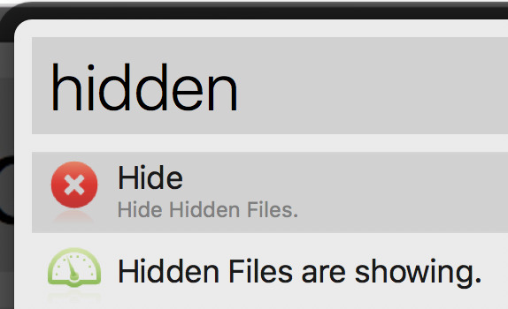

AlfredHiddenFilesToggle
================

Alfred Workflow for toggle the `show/hide` status of hidden files in MacOS.

Its function is the same as the mac app called `invisibliX`.

Test passed in Alfred3 and MacOS 10.12.

## Install

- Download `Hidden Files Toggle.alfredworkflow`.

- Install it by double-click.

## Usage

- Just type **`hidden`** to use. It will automatically switch between show/hide status:

- Manual mode:

Type `hidden show` or `hidden hide` like this:

If the following notice appears, the switch is successful.

## Thanks

This is the first alfred workflow I wrote, learning from the [caffeinate](http://packal.org/workflow/caffeinate-control) project.
